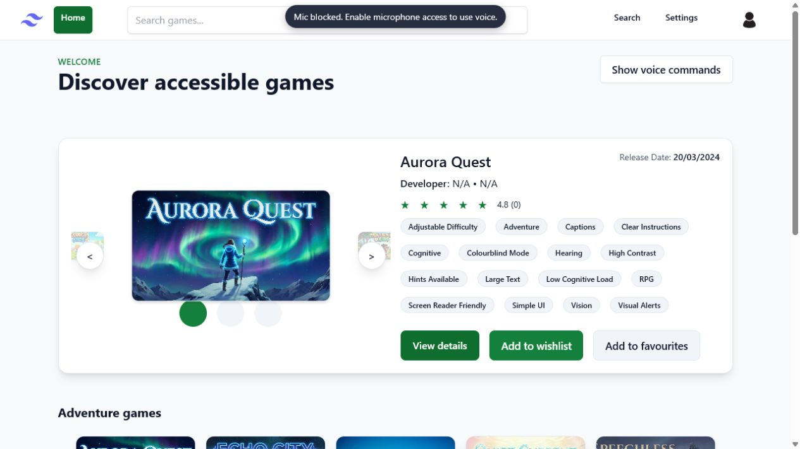

# Accessible Games Catalog

An accessibility-first games discovery platform built as a Cardiff University group project. Users can search by accessibility needs, personalise their experience, receive recommendations, write and vote on reviews, manage saved games, and navigate core flows with voice commands.

> Portfolio snapshot: this repository contains a clean copy of the final project source. University Git history, generated dependencies, private configuration, and third-party game artwork are intentionally excluded.



## Highlights

- Accessibility filters covering vision, hearing, motor, speech, and cognitive needs
- Personalised recommendations based on a user's saved accessibility preferences
- JWT authentication, profile management, password updates, and role-aware routes
- Reviews, helpful votes, favourites, wishlist, and game reporting
- Admin workflow for resolving reports and removing games
- Voice navigation with a wake word, deterministic intent parsing, and page-specific actions
- Configurable text size, spacing, controls, themes, captions, visual alerts, and reduced motion
- OpenAPI documentation, Postman checks, Docker Compose, and automated CI

## Technology

| Area | Tools |
| --- | --- |
| Frontend | React 19, React Router, Vite, Tailwind CSS, Headless UI |
| Backend | Node.js, Express 5, Sequelize, JWT, bcrypt |
| Data | MariaDB in development; SQLite for isolated tests |
| Quality | Jest, Supertest, Vitest, React Testing Library, OpenAPI, Postman |
| Delivery | Docker Compose, GitHub Actions, Dependabot |

## Verified quality

- 322 automated tests: 89 backend and 233 frontend
- Backend line coverage: 84.83%
- Production frontend build verified with Vite
- CI runs the backend suite against in-memory SQLite, the frontend suite, and the production build

## Run locally

Prerequisites: Node.js 20+, npm, and MariaDB.

```bash
npm ci
npm ci --prefix backend
npm ci --prefix frontend
```

Copy `backend/.env.example` to `backend/.env`, replace all placeholder secrets, then run:

```bash
npm run dev
```

- Frontend: `http://localhost:5173`
- API: `http://localhost:5000/api`
- Swagger UI: `http://localhost:5000/api-docs`

For a containerised setup, set `MARIADB_ROOT_PASSWORD` and `JWT_SECRET` in your shell, then use `docker compose up --build`.

## Test and build

```bash
# All backend tests using isolated SQLite
npm --prefix backend run coverage:all

# Frontend tests
npm run test:frontend

# Production frontend build
npm --prefix frontend run build
```

## API and project documentation

- OpenAPI contract: `backend/openapi.yaml`
- Postman collection: `backend/postman/`
- Voice intent parser: `backend/voice/intent.js`
- Frontend voice modules: `frontend/public/voice/`
- Portfolio contribution notes: [`PORTFOLIO.md`](PORTFOLIO.md)

## Group project and contribution context

The original project was developed by Tiago Moico, Etienne Hurley, Alexandru Mataoanu, and Taylor Fereday. The application is presented as collaborative work; no claim is made that one person authored the entire codebase.

The university Git history attributes Tiago's work across the games data model and seeding, game-detail and review flows, database-backed homepage content, accessibility-preference recommendations, administrative reporting/deletion, automated tests, Postman checks, CI configuration, and documentation. See [`PORTFOLIO.md`](PORTFOLIO.md) for a concise evidence-based summary suitable for recruiters.

## Security and sample data

- Real `.env` files are ignored; only a placeholder `.env.example` is included.
- Docker defaults are development-only and should be overridden.
- Seeded users and content are fictional demonstration data.
- The original university repository history is not included because it contained local configuration and contributor email addresses.

## Usage rights

No project-level open-source licence was supplied with the original group project. The code is shared for portfolio review; reuse rights are not granted unless all relevant authors agree to a licence.
